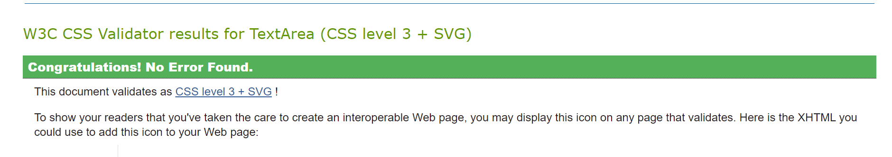
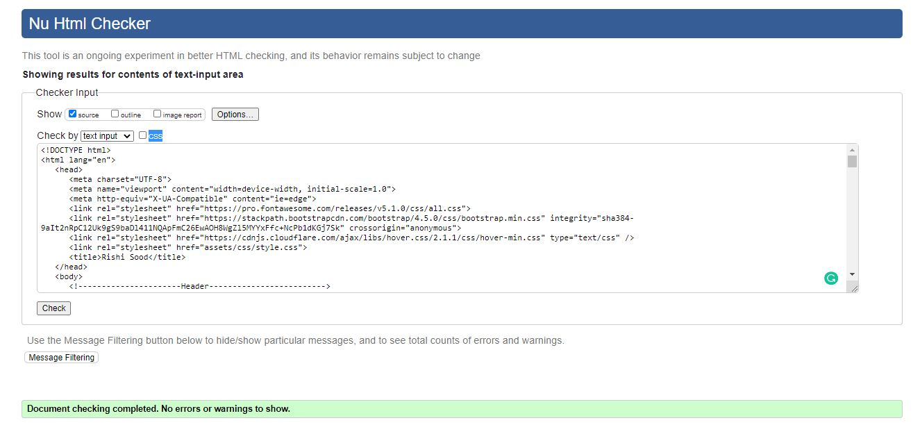
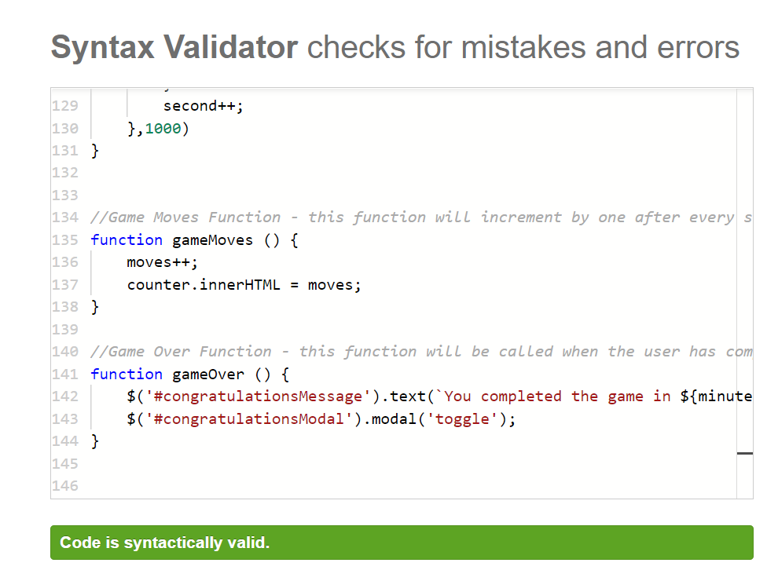

# Milestone Project 2

[Live Link to project here](https://rishisood1.github.io/Memory-Game-MS2/)

This is my second project for Code Institute. For my project I decided to make a memory game in which users would try to make matches with the cards in order to complete the game in the shortest amount of time and least number of moves. 
The user will click on the cards and if they match the cards will stay open and if they do not the cards will flip back round. 
Once all the cards have been matched a modal will appear on the screen. 
The modal will consist of the number of moves the user did and how long it took them to complete the game. 
The game was created to be suitable for all ages.

## UX

I wanted to keep the design of the game as intuitive and simple as possible. To do this I decided on a basic yet bold design which I believed would be the best way forward. 
The page has a white background with the text being black. I used Exo as the font throughout the page as I believe the font stands out well. 
The page also has a modal appear once the user has completed the game, this saved me creating a new page just to display a congratulations message.

The game is made up of a 4 by 4 grid. The back of the cards all have the same design on them while the front of the cards are different to each other. 
To flip the card, I had to use JavaScript in which I will talk about in detail below. 

### User Stories 

* As a user I want to play a memory game in which I must match up cards in the fewest amount of moves and least amount of time. 
* As a user I expect there to be a timer so I can see how long I have taken to complete the game as well as a counter to see ho many moves I have taken. 
* As a user I would expect the game to be able to be played on any devices and the design remains the same even though they are on different screen sizes.
* As a user I expect there to be an option which allows me to restart the game.
* As a developer, I want to create a game which can be played by people of any age and can enjoy themselves.

### Wireframes

I created my wireframes on Figma. I first designed the basic layout of the webpage, once that was done, I started adding colours to see how it would look before deciding on my final colour scheme.

[Figma Wireframes](https://www.figma.com/file/K1UwoM441RtYMO9m1scFmV/Memory-Game---MS2?node-id=0%3A1)

## Features

* Feature 1 – A Memory Game – The main feature is the memory game which has been created for the user to enjoy. 
* Feature 2 – Randomised tile placements – A key component of the game is that the tiles are randomised when a new game is started, this is required otherwise the tile placements would remain the same and there would not be any point in the game as the user would know where the tiles are. 
* Feature 3 – A modal which appears at the end of the game – the modal which appears at the end of the game allows the user to see their game statistics, it also allows the user to play the game again by clicking a button.  The modal allows me to display data on the same screen instead of creating a new page just to display the users game statistics
* Feature 4 – A timer and move counter – With the main aim of the game to try and complete it in the least amount of time and least number of moves, the timer and counter allows the user to see how they are getting along. This data is also displayed in the modal at the end of the game
* Feature 5 – Restart and start button – The buttons at the top of the page allow the users to start the game. If they do not click the start button, the timer would not run so it is imperative that they do. The restart button allows the users to restart the game, if clicked the timer and move counter will reset and the cards will shuffle. 

### Features left to implement

One feature that I would like to implement would be to increase the grid size, so the game becomes a bit more difficult as they must remember more cards.
Another feature is the option of difficulty levels. To make the game more difficult I could increase the grid size as mentioned above or even reduce the times between the card being clicked and when it flips back over for the user to have less time to remember what logo is on each card. 

### Colours

The game does not have many colours with the background being white and the text being black, the only colours that can be seen are the buttons which are red and green. 

### Font

As my project I created was a game, there did not need to be much text, however when there was, I wanted the text to stand out. The font I used was Exo and I believed it was the font which stood out the most

## Technologies Used

* [HTML5](https://en.wikipedia.org/wiki/HTML5) – HTML was used to create the basic structure of the website.
* [CSS3](https://en.wikipedia.org/wiki/CSS) - I used CSS to style the pages of the website.
* [JavaScript](https://www.javascript.com/) – This was used to write the script which would make the game run. 
* [Font Awesome](https://fontawesome.com/) – I used font awesome for the images which appear on the cards. 
* [Bootstrap](https://getbootstrap.com/) – I used v4.5 of bootstrap for the modal as well as the buttons. 
* [jQuery](https://jquery.com/) - The project uses JQuery to simplify DOM manipulation.
* [GitHub](https://github.com/) – I used GitHub to create the repository, it also hosts the website. 
* [Gitpod](https://www.gitpod.io/) -  This was the IDE I used for the project
* [W3C Markup Validation Service](https://validator.w3.org/) – I used this to validate my HTML to see if there were any errors in my HTML. 
* [W3C CSS Validation Service](https://jigsaw.w3.org/css-validator/) - I used this to validate my CSS to see if there were any errors in my CSS.
* [JavaScript Validator](https://esprima.org/demo/validate.html) – I used this to check the syntax in my JavaScript was all correct. 

## Testing 

* Card Flip – When the user clicks on the card, the card is expected the flip revealing the icon on the back of the card. When I tested this, the card did flip worked as expected without any errors. 
* Card Match – When the user clicks on two cards and they turn over the same logo, the two cards should remain locked on the screen. To test this, I played the game and when there was a match, the matched cards remained locked on the screen. 
* Card Unmatched - When the user clicks on a card, and they do not match, the card is expected to flip back over. To test this, I again played the game and when the cards did not match, they did flip back over as was expected. 
* Modal – Once the game is complete the user should have a modal appear on the screen, the modal should give the user their game statistics. To test this feature, I completed the game and at the of the game, a modal did appear and did include all the right information that was expected. Also, in the modal a play again button was present and when clicked, the game restarted. 
* Buttons – There are three buttons on the page. A start button, a restart button and a play again button. When clicked each should run its own function. The start button should start the game timer, the restart button should reset the timer and counter while also shuffling the cards on the board while the play again button should allow the user to play the game again. When tested, each of the buttons fulfilled their expected functions. 
* Timer - The game timer should start when the user clicks the start button. The timer should start by incrementing the seconds and once the seconds hit 60, the timer should change to 1 minute + seconds. When tested, the timer worked as expected. 
* Move Counter – Similar to the timer, the counter is expected to increment by 1 however it is only set to increase after every second card is turned over. When I tested this, the counter worked as expected. 
* To summarize, all the features of the game work as they were expected to and there were not any issues that I came across when conducting the tests. 

### Testing Stories from UX section 

#### User Visitor Goals

* As a user I want to play a memory game in which I must match up cards in the fewest amount of moves and least amount of time. 

1. As there is only one page, the user automatically arrives onto the page in which the game is on. 
2. If the user clicks the start button, the timer will automatically start.
3. There are functions which will count the users number of moves.
4. At the end of the game a modal will appear which shows the user games statistics. 

* As a user I expect there to be an option which allows me to restart the game.

1. As the user will be able to see, there is a restart button at the top of the page.
2. When clicked, the game will restart. This includes the game moves, the timer and the cards will shuffle. 

* As a user I would expect the game to be able to be played on any devices and the design remains the same even though they are on different screen sizes.

1. By using media queries, the game can be played on all screen sizes without any issues. 
2. The game was tested on many different screen sizes in order to ensure that there werent any issues with the sizing.

### Testing Tools

I used the following validation services to validate my code:

* W3C Markup Validation Service 
* W3C CSS Validation Service
* JavaScript Validation Service

All three of the validation services showed that there were not any errors with the code I had written. 

<h4 align="center"></h4>
<h4 align="center"></h4>
<h4 align="center"></h4>

### Testing Methods

I used the following devices to test my website on smaller screen sizes:

* Samsung S20
* iPad Pro
* Samsung S10

I then used the developer tools on Google Chrome to test the website on different devices. The devices I tested the site on are as follows:

* iPhone X
* iPad
* Moto G4

## Deployment

I used GitHub pages to deploy my website. The way I did this is shown below:

1.	I first logged into my GitHub account
2.	I clicked on the Memory-Game-MS2 repository and then went onto the settings tab.
3.	I scrolled to the bottom of the page and went to the GitHub pages area
4.	In the GitHub pages section, I changed the branch dropdown list option from none to master.
5.	After this, the page automatically refreshed and the link to the website now appears.

To run the code locally, the following steps need to be undertaken:

1.	In the Memory-Game-2 repository, click clone or download
2.	A URL will pop up, in which you should copy the URL
3.	Open an IDE of your choice
4.	In the terminal, type in git clone and paste the URL you copied earlier and hit the enter button.

## Credits

### Content 

* The fonts were used from Google Fonts
* The icons were used from the Font Awesome website
* The modal and buttons were used from the bootstrap documentation page. 

### Acknowledgments 

* I received advice from my mentor Aaron Sinnott
* I also received help from the Code Institute Mentoring team who helped me when I had errors which I could not fix myself
* (https://www.youtube.com/watch?v=ZniVgo8U7ek) – I used this video to guide on how to create 3D transitions when it came to the flipCard functions as well as provide some inspiration on how to create the game

